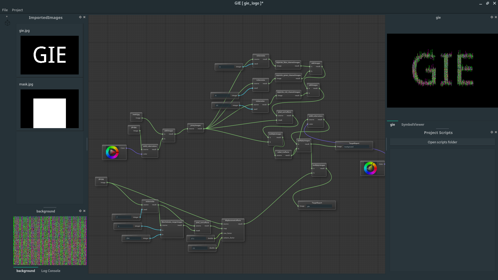
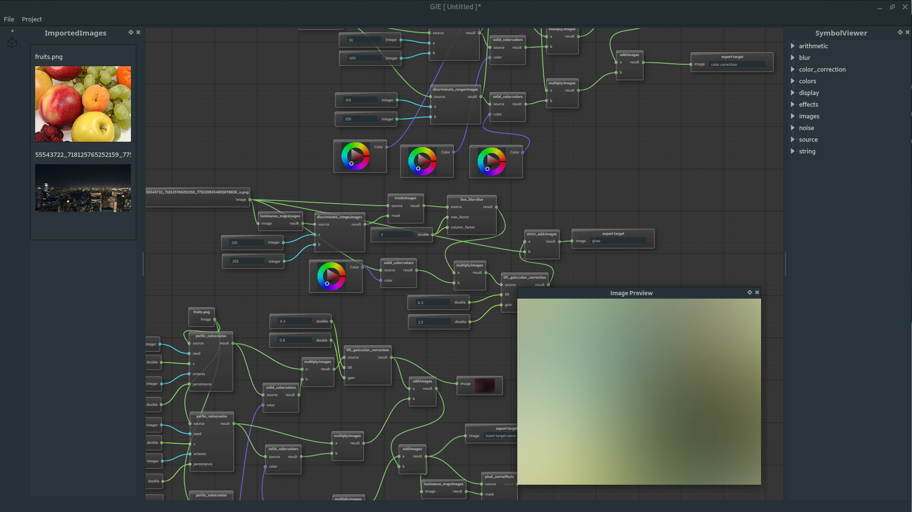
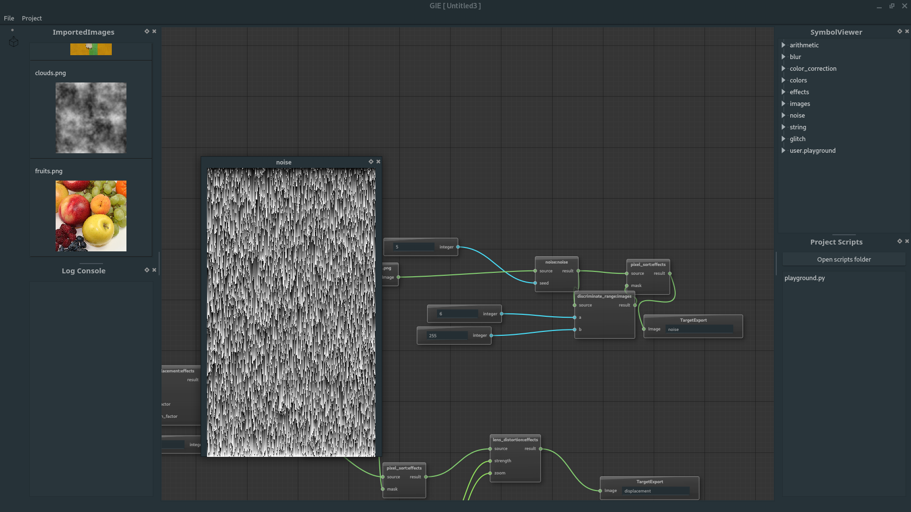
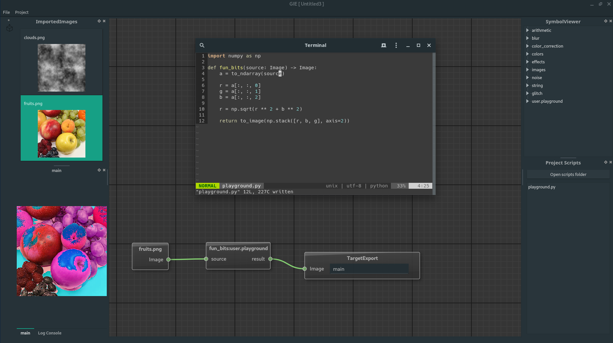

# GIE


GIE (Generative Image Editor, `/jəī/`) is a node based image editor, inspired by Blender's material node editing feature. Building upon the descriptive nature of visual data flow programming, each node represents a mutation done to a source image.


## Usage
The UI is intended to be relatively straight-forward. Much like in Blender, the right click context menu contains all possible nodes. In order to use pictures as sources, the user has to import them through the menu present on the top bar.
Similarly, exporting is done using the export button present on the toolbar menu.

*Documentation of each node's behaviour coming soon*

## Installation
### *nix
*Building has been only attempted on Linux (Manjaro with recent packages). While the code is written to be cross platform, there is no guarantee that it is going to work straight out of the box on Mac OSX, FreeBSD etc. Please open an issue if you find any major issues that you need help with.*

Requirements:
* c++17 compatible compiler (gcc recommended!)
* boost.python
* qt5
* python environment + numpy and scipy

```bash
git clone https://github.com/alexge50/gie.git
cd gie
git submodule init; git submodule update
mkdir build; cd build
cmake ..
make
make install
```
**Disclaimer:** Due to a [bug](https://github.com/paceholder/nodeeditor/issues/238) in one of the gie's dependencies, clang on release is not recommended.

### Windows
* binaries coming soon

## Screenshots









## Change log
`version 0.2.0`:
* live code reload
* numpy integration
* moved compute work to separated thread
* added various nodes
* log console

`version 0.1.0`:
* initial version
* load/open project
* import/export images
* node based editor

## TODO
* custom Qt UI theme
* multi-threading - allowing multiple nodes to be run at the same time
